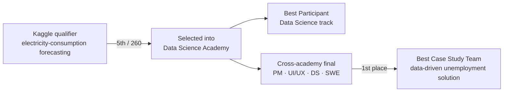

# DSA Compfest 2025 — Data Science Academy 🏆 5/260 · Best Participant · Team 1st Place

> My strongest competition arc: **ranked 5th of 260** on the Kaggle qualifier, selected into the
> **Data Science Academy**, named **Best Participant** in the DS track, and won **1st place** as part of a
> cross-academy team on a data-driven policy case study.

**Program:** Compfest — Data Science Academy (DSA)
**Results:**
- 🥉 **5th / 260** on the Kaggle qualifier (electricity-consumption forecasting)
- 🏅 **Best Participant** — Data Science track (individual award)
- 🥇 **1st place — Best Case Study Team** — cross-academy final (PM · UI/UX · DS · SWE)

> **Note:** the qualifier code lives on Kaggle (link below); this repo documents the work and results.

---

## The journey

## Part 1 — Kaggle qualifier (5th / 260)

Time-series **electricity-consumption forecasting**. The decisive edge was **feature engineering**, on top
of a **stacked XGBoost + LightGBM** ensemble tuned with **Optuna**.

- **Models:** XGBoost + LightGBM, stacked; Optuna hyperparameter search.
- **What moved us up the board:** systematic feature engineering (the single most important factor).
- **What I'd try next:** deep-learning sequence models (e.g. temporal architectures) beyond GBMs.

🔗 **Live notebook:** [kaggle.com/frederickallensius/cupuu-lightgbm-xgboost-with-optuna](https://www.kaggle.com/code/frederickallensius/cupuu-lightgbm-xgboost-with-optuna)

<!-- TODO(from Frederick): confirm exact forecast target/horizon, the leaderboard metric (RMSE/MAE/…),
     and our score vs. the top team, to complete this section. -->

## Part 2 — Data Science Academy → Best Participant

Selected from the qualifier into the Academy; named **Best Participant** in the Data Science track (top
individual in the DS cohort).

## Part 3 — Cross-academy final → 1st place (Best Case Study Team)

Compfest teams up its academies (Product Management, UI/UX, Data Science, Software Engineering) for a
final build. My team produced a **data-driven solution for unemployment** and won **1st place
(Best Case Study Team)**. My contribution was the **data analysis and visualization**, done collaboratively
with other DSA participants.

🔗 **Final presentation (Canva):** [link](https://www.canva.com/design/DAGyjDeeeFQ/2y_4P-01F0ShXgC1pMEwng/edit)

---

## Tech stack

`Python` · `XGBoost` · `LightGBM` · `Optuna` · `pandas` · `scikit-learn` · data storytelling / visualization

## Screenshots

<!-- TODO: add screenshots -->
- `TODO:` Kaggle leaderboard (5 / 260)
- `TODO:` Best Participant certificate
- `TODO:` 1st-place (Best Case Study Team) certificate / photo
- `TODO:` a slide or two from the final case-study deck

---

## Collaborators

The Kaggle qualifier was built with my regular competition team:

- **Nicho Darren** — GitHub [@nichodarren](https://github.com/nichodarren) · [LinkedIn](https://linkedin.com/in/nichodarren/)
- **Ivan William** — GitHub [@IvanWiliam13](https://github.com/IvanWiliam13) · [LinkedIn](https://linkedin.com/in/ivanwilliaml/)

The cross-academy final was delivered with a separate mixed-academy Compfest team.
