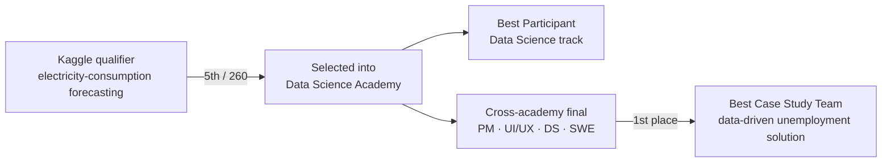

# DSA Compfest 2025 — Data Science Academy 🏆 5/260 · Best Participant · Team 1st Place

> My strongest competition arc: **ranked 5th of 260** on the Kaggle qualifier, selected into the
> **Data Science Academy**, named **Best Participant** in the DS track, and won **1st place** as part of a
> cross-academy team on a data-driven policy case study.

**Program:** Compfest — Data Science Academy (DSA)
**Results:**
- 🥉 **5th / 260** on the Kaggle qualifier (electricity-consumption forecasting)
- 🏅 **Best Participant** — Data Science track (individual award)
- 🥇 **1st place — Best Case Study Team** — cross-academy final (PM · UI/UX · DS · SWE)

---

## The journey



## Part 1 — Kaggle qualifier (5th / 260)

**Task:** forecast daily **`electricity_consumption`** for each of several **clusters** from historical
usage plus weather/agronomic signals (temperature, evapotranspiration, etc.). **Metric: RMSE.**

The decisive edge was **feature engineering**, on top of Optuna-tuned gradient boosting:

- **Per-cluster models** (a model trained per `cluster_id`) — which, combined with a targeted
  post-processing correction, beat a single global model with one-hot clusters on this metric.
- **Feature engineering:** cyclical time encodings, temporal shifts, log-transforms of skewed columns,
  "distance-from-minimum" shifting, and **lag & rolling features** (`consumption_lag_1`, `lag_7`,
  `lag_1_vs_lag_7_diff`, …).
- **Models:** LightGBM + XGBoost regressors, tuned with **Optuna** (RMSE objective, `random_state=42`).
- **A competition-specific trick:** the model tended to over-predict peaks, so subtracting a small constant
  from all predictions lowered peak RMSE more than it cost in the valleys — a leaderboard-driven correction
  (documented in the notebook as a metric hack, not a production choice).
- **What I'd try next:** deep-learning sequence models (temporal architectures) beyond GBMs.

📓 Notebook: [`notebook/electricity_forecasting.ipynb`](./notebook/electricity_forecasting.ipynb)
🔗 Also on Kaggle: [frederickallensius/cupuu-lightgbm-xgboost-with-optuna](https://www.kaggle.com/code/frederickallensius/cupuu-lightgbm-xgboost-with-optuna)

## Part 2 — Data Science Academy → Best Participant

Selected from the qualifier into the Academy; named **Best Participant** in the Data Science track (top
individual in the DS cohort).

## Part 3 — Cross-academy final → 1st place (Best Case Study Team)

Compfest teams up its academies (Product Management, UI/UX, Data Science, Software Engineering) for a
final build. My team produced a **data-driven solution for unemployment** and won **1st place
(Best Case Study Team)**. My contribution was the **data analysis and visualization**, done collaboratively
with other DSA participants.

🔗 **Final presentation (Canva):** [link](https://www.canva.com/design/DAGyjDeeeFQ/2y_4P-01F0ShXgC1pMEwng/edit)

---

## Tech stack

`Python` · `LightGBM` · `XGBoost` · `Optuna` · `pandas` · `scikit-learn` · data storytelling / visualization

## Repository structure

```
dsa-compfest-2025/
├── notebook/
│   └── electricity_forecasting.ipynb   # per-cluster GBM forecasting + Optuna + FE
├── README.md
└── .gitignore                          # competition dataset excluded (not redistributable)
```

## How to run

> ⚠️ The competition dataset (`seleksi-dsa-compfest-17`) is **not included** — DSA Compfest rules do not
> allow redistribution. Place `train.csv` / `test.csv` under a `data/` folder and update the paths.

```bash
pip install lightgbm xgboost optuna pandas scikit-learn
jupyter notebook notebook/electricity_forecasting.ipynb
```

## Screenshots

<!-- TODO: add screenshots -->
- `TODO:` Kaggle leaderboard (5 / 260)
- `TODO:` Best Participant certificate
- `TODO:` 1st-place (Best Case Study Team) certificate / photo

---

## Collaborators

The Kaggle qualifier was built with my regular competition team:

- **Nicho Darren** — GitHub [@nichodarren](https://github.com/nichodarren) · [LinkedIn](https://linkedin.com/in/nichodarren/)
- **Ivan William** — GitHub [@IvanWiliam13](https://github.com/IvanWiliam13) · [LinkedIn](https://linkedin.com/in/ivanwilliaml/)

The cross-academy final was delivered with a separate mixed-academy Compfest team.
